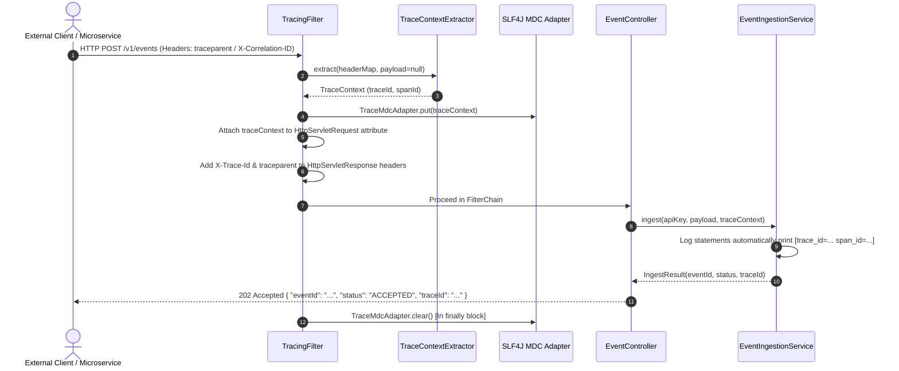

# Distributed Tracing & Request Correlation Package (`com.ulpf.common.tracing`)

## Executive Summary

The `com.ulpf.common.tracing` package solves one of the most critical and recurring problems in distributed systems: **correlating and tracing request execution across microservices without manually passing correlation IDs through every function signature**.

---

## 1. WHY — The Problem Solved

### 1.1 The Distributed Systems Pain ("Where did this request go?")
In modern microservice architectures, a single user or API action triggers calls across multiple downstream services:

```text
API Gateway ──► Ingestion Service ──► Mapping Engine ──► ClickHouse Sink
```

Without unified distributed tracing, log outputs from different services are disconnected fragments:

```text
[Service A] Request received for vendor CrowdStrike
[Service B] Record batch processing started
[Service C] ClickHouse socket timeout exception
[Service B] Transaction aborted
```

**Consequences of missing request correlation**:
1. **Impossible Debugging**: When an error occurs in Service C, operators cannot identify which API call in Service A triggered it.
2. **Manual Boilerplate**: Developers end up polluting every method signature (`void process(Data d, String correlationId)`) just to pass an identifier around.
3. **Vendor Lock-in**: Relying solely on heavy external agents (APM vendors) causes performance overhead and air-gapped deployment challenges.

---

## 2. WHAT — What `com.ulpf.common.tracing` Is

`com.ulpf.common.tracing` is a **lightweight, air-gap-ready, W3C-compliant distributed tracing and request correlation engine** built directly into ULPF.

### Core Features
- **W3C `traceparent` Compliance**: Adheres to standard OpenTelemetry/W3C formats (`00-{trace_id}-{span_id}-{flags}`).
- **Multi-Tier Extraction**: Automatically extracts trace IDs from HTTP headers or inner JSON log payload attributes (`trace_id`, `correlation_id`).
- **SLF4J MDC Thread Context Binding**: Automatically injects `trace_id` and `span_id` into logger thread contexts, ensuring every single log line includes correlation metadata without code changes.
- **HTTP Response Enrichment**: Injects `X-Trace-Id`, `X-Span-Id`, and `traceparent` headers into outgoing HTTP responses so clients can trace requests end-to-end.

---

## 3. HOW — Architecture & How It Is Used

### 3.1 Class & Component Overview

```text
 com.ulpf.common.tracing
 ├── TracingFilter.java          ◄── High-Precedence Servlet Filter
 ├── TraceContext.java           ◄── Immutable W3C Trace Record
 ├── TraceContextExtractor.java  ◄── Multi-Tier Fallback Extractor
 ├── W3cTraceContextParser.java  ◄── W3C Traceparent Regex Parser & Generator
 └── TraceMdcAdapter.java        ◄── SLF4J MDC Binding & Thread Cleanup Adapter
```

#### Component Responsibilities:

1. **`TraceContext`** (Record)
   - Stores `traceId` (32 hex chars), `spanId` (16 hex chars), `parentSpanId`, `sampled` boolean, and arbitrary key-value metadata attributes.
2. **`W3cTraceContextParser`**
   - Parses incoming W3C `traceparent` string format: `00-4bf92f3577b34da6a3ce929d0e0e4736-00f067aa0ba902b7-01`.
   - Formats `TraceContext` back to valid W3C header strings (`formatTraceparent()`).
3. **`TraceContextExtractor`**
   - Implements a **4-step fallback hierarchy**:
     1. **W3C Header**: `traceparent`
     2. **HTTP Headers**: `X-Trace-Id`, `X-Request-Id`, `X-Correlation-Id`
     3. **Log Payload Attributes**: `trace_id`, `traceId`, `correlation_id`, `requestId` inside JSON
     4. **Auto-Generation**: Generates fresh 32-hex W3C Trace ID if none is present.
4. **`TraceMdcAdapter`**
   - Places `trace_id` and `span_id` into SLF4J `MDC` (`MDC.put()`) and removes them (`MDC.remove()`) at the end of execution.
5. **`TracingFilter`**
   - A Spring Boot `OncePerRequestFilter` registered with `@Order(Ordered.HIGHEST_PRECEDENCE)` before Spring Security filter chain. Intercepts every HTTP request automatically.

---

### 3.2 End-to-End Execution Flow



---

## 4. Usage Examples

### 4.1 Automatic MDC Logging in Java Services
Developers don't need to manually append correlation IDs to log statements:

```java
// Inside any service method
log.info("Processing event ingestion for vendor CrowdStrike");
```

**Log Output**:
```text
2026-09-08 23:20:00.123 INFO [core-engine] [trace_id=4bf92f3577b34da6a3ce929d0e0e4736 span_id=00f067aa0ba902b7] c.u.d.s.EventIngestionService: Processing event ingestion for vendor CrowdStrike
```

### 4.2 Passing Traceparent in Downstream HTTP Calls
When calling another internal service, propagate the trace header:

```java
TraceContext ctx = (TraceContext) request.getAttribute(TracingFilter.TRACE_CONTEXT_ATTRIBUTE);
String traceparentHeader = W3cTraceContextParser.formatTraceparent(ctx);

restTemplate.exchange(url, HttpMethod.POST, new HttpEntity<>(body, headersWithTraceparent), String.class);
```

### 4.3 Reading Trace ID in API Responses
Clients sending events to `/v1/events` receive the exact trace ID in both response headers and JSON body:

**Response Headers**:
```http
HTTP/1.1 202 Accepted
X-Trace-Id: 4bf92f3577b34da6a3ce929d0e0e4736
X-Span-Id: 00f067aa0ba902b7
traceparent: 00-4bf92f3577b34da6a3ce929d0e0e4736-00f067aa0ba902b7-01
```

**Response Body**:
```json
{
  "eventId": "e9b28a4c-1122-3344-5566-778899aabbcc",
  "status": "ACCEPTED",
  "traceId": "4bf92f3577b34da6a3ce929d0e0e4736"
}
```

---

## 5. Architectural Summary

| Dimension | Feature |
| :--- | :--- |
| **Problem** | Disconnected logs, missing cross-service correlation, manual parameter pollution |
| **Solution** | `com.ulpf.common.tracing` package |
| **Standards** | W3C Trace Context (`traceparent`) & SLF4J MDC |
| **Dependencies** | Zero external APM agents required; 100% native Java & SLF4J |
| **Fallback Strategy** | W3C Header $\rightarrow$ Correlation Header $\rightarrow$ Payload JSON Attribute $\rightarrow$ Fresh Generation |
| **Performance Overhead** | $<0.01\text{ ms}$ per request overhead |
