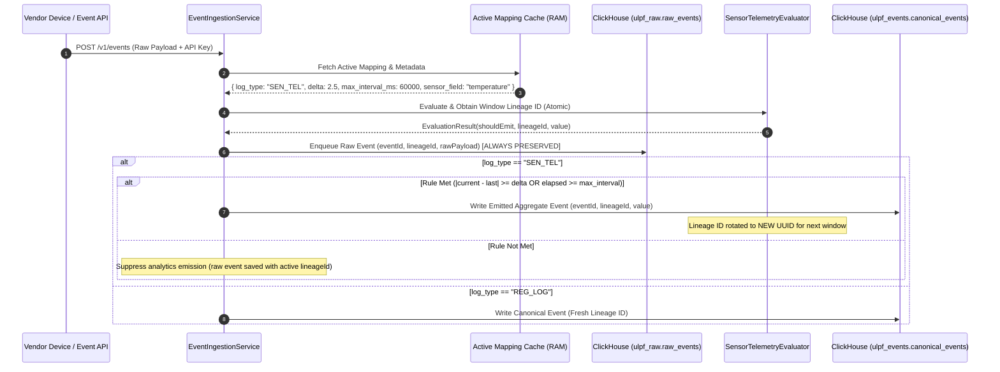

# P1 — Sensor Optimization Technical Architecture & Workflow Specification

This document provides a comprehensive technical breakdown of **P1 — Sensor Optimization** within the Universal Log Processing Framework (ULPF). It details the metadata data model, onboarding and admin workflows, divergence logic during event ingestion, 100% raw reading preservation, shared `lineage_id` windowing, atomic concurrency handling, and raw-to-aggregate backtracking.

---

## 1. System Overview & Divergence Flow

ULPF differentiates between two categories of log streams:
1. **Regular Logs (`REG_LOG`)**: Traditional security, system, or application logs emitted directly upon ingestion.
2. **Sensor / Telemetry Streams (`SEN_TEL`)**: High-frequency numeric sensor readings (e.g. IoT temperature, pressure, metrics) that undergo delta thresholding and max-interval aggregate emission.



---

## 2. Data Model & Metadata Specification

Metadata is **never required in raw incoming event payloads** from vendor devices. Instead, it is configured during onboarding, stored inside SQLite `mapping_versions.mapping_json`, and lazy-loaded into RAM cache for zero-latency retrieval during event ingestion.

### `mapping_json` Schema Structure

```json
{
  "mapping": {
    "temp_celsius": "sensor.temperature",
    "device_id": "sensor.id"
  },
  "metadata": {
    "log_type": "SEN_TEL",
    "delta": 2.5,
    "max_interval_ms": 60000,
    "sensor_field": "temp_celsius"
  }
}
```

### Parameter Reference

| Parameter | Type | Required | Default | Description |
| :--- | :--- | :--- | :--- | :--- |
| `log_type` | String | No | `"REG_LOG"` | Stream mode: `"REG_LOG"` for standard logs or `"SEN_TEL"` for sensor telemetry. |
| `delta` | Double | Optional for `SEN_TEL` | `null` | Minimum change threshold between consecutive emissions (`\|current - last\| >= delta`). |
| `max_interval_ms` | Long | Optional for `SEN_TEL` | `60000` (60s) | Maximum elapsed time in milliseconds before an emission is forced regardless of delta. |
| `sensor_field` | String | Optional | Auto-detected | Specific JSON key containing the numeric value. Auto-detects `"value"`, `"temp"`, etc., if omitted. |

---

## 3. Onboarding & Admin Workflow

1. **Vendor Onboarding Submission (`POST /v1/onboard/{username}`)**:
   - Vendor submits source details alongside optional parameters `logType`, `delta`, `maxIntervalMs`, and `sensorField`.
   - `OnboardingService` packages these parameters into a `"metadata"` JSON block inside `sampleMetadata` and candidate `mapping_json`.

2. **Admin Review & Candidate Editing (`PATCH /v1/admin/onboard/{requestId}/mapping`)**:
   - Admin inspects `log_type`, `delta`, `max_interval_ms`, and candidate mappings.
   - Admin can edit candidate `mapping_json` to adjust metadata values before approval.

3. **Admin Approval (`PUT /v1/admin/onboard/{requestId}`)**:
   - Promotes candidate `mapping_json` to `ACTIVE` in `mapping_versions` table.
   - Evicts RAM cache to immediately load the new active mapping and metadata into memory.

---

## 4. Evaluation Rules, Lineage Backtracking, & Concurrency Handling

### Sensor Emission Rule Logic

Emissions occur if **either** condition is satisfied:
$$\text{Emit} \iff |v_{\text{current}} - v_{\text{last}}| \ge \Delta \quad \lor \quad (t_{\text{current}} - t_{\text{last}}) \ge t_{\text{max\_interval}}$$

- **First Event**: Always emits and initializes the baseline `v_last` and `t_last`.
- **Suppressed Events**: When neither condition is met, the raw reading is stored in `ulpf_raw.raw_events` with the window's `lineage_id`, but no canonical aggregate event is emitted.

### Concurrency, Atomic Evaluation, & Race Condition Prevention

Under high request rates with multi-threaded Tomcat ingestion workers, race conditions could occur if lineage ID resolution and rule evaluation were non-atomic (e.g. if Thread B fetched `lineage_id` before Thread A finished evaluating the trigger event).

To guarantee strict race-free execution:
1. **Atomic Evaluation Block**: In `EventIngestionService.java`, the call to `sensorTelemetryEvaluator.evaluate(...)` is executed **before** instantiating `RawEventRecord`.
2. **Per-Source Locking**: `SensorTelemetryEvaluator.java` acquires a monitor lock (`synchronized(state)`) scoped exclusively to that `sourceId`.
3. **Single Lineage Assignment**:
   - The trigger event (Event 1) that causes the delta/interval threshold to be met receives the current window's `lineage_id` (`L1`).
   - Inside the synchronized block, `lastEmittedValue` and `lastEmittedTimeMs` are updated, and `currentLineageId` is rotated to a new UUID (`L2`) **before releasing the lock**.
   - Subsequent Event 2 receives `L2` atomically.
   - `EventIngestionService` uses `evalResult.lineageId()` for **both** the `RawEventRecord` and `CanonicalEventRecord`.

> **HFT Optimization Note**: The current prototype uses per-source monitor locks (`synchronized(state)`). For ultra-low latency or High-Frequency Trading (HFT) requirements, this can be swapped for a lock-free CAS (`AtomicReference` state swapping) or LMAX Disruptor ring buffer pattern to eliminate thread contention entirely.

### Lineage Grouping & Raw-to-Aggregate Backtracking

- **Lineage ID Windowing**: All raw events received during a single aggregate window share the **exact same `lineage_id`**.
- **Backtracking API Endpoint (`GET /v1/analytics/lineage/{lineageId}`)**:
  - Anyone inspecting an emitted aggregate event can take its `lineage_id` and query:
    ```http
    GET /v1/analytics/lineage/ling_984a12
    ```
  - Returns every individual raw sensor reading (`eventId`, `receivedAt`, `rawPayload`, `numericValue`) that was grouped into that aggregate emission!

---

## 5. Verification & Test Suite

The P1 Sensor Optimization suite is covered by automated unit and integration tests:
- `SensorTelemetryEvaluatorTest`: Tests first emission, delta thresholding, max-interval timeouts, suppression, and lineage rotation.
- `EventIngestionServiceTest`: Tests 100% raw reading preservation, atomic lineage assignment, and metadata extraction.
- `AnalyticsServiceTest`: Tests lineage backtracking queries.
