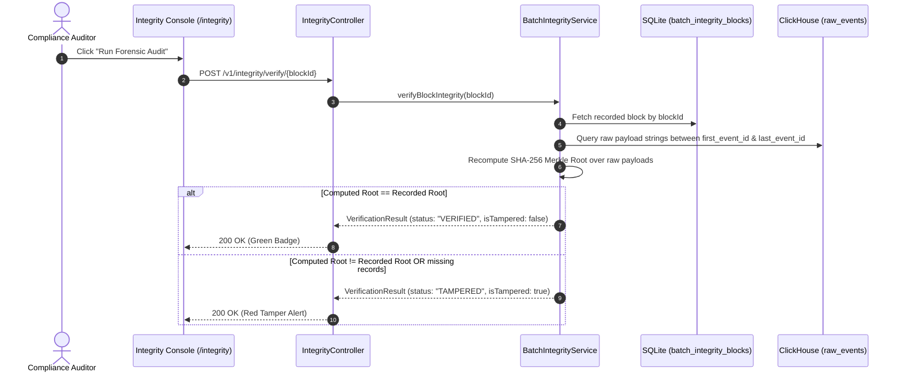

# Merkle-Tree Batch Tamper-Evidence, Lossless Overflow, and Distributed Tracing Architecture

## Executive Summary

The **Universal Log Platform Framework (ULPF)** incorporates high-assurance cryptographic integrity verification, zero-data-loss schema evolution, automated schema drift notifications, and W3C-compliant distributed tracing context propagation.

This architectural document details the design, cryptographic primitives, database schemas, and API contracts behind these production capabilities.

---

## 1. Merkle-Tree Cryptographic Batch Tamper-Evidence & Forensic Audit Engine

### 1.1 Problem Statement & Threat Model
In high-security SIEM and compliance environments (e.g., NTRO, SOC 2, ISO 27001), raw log data stored in analytical databases (such as ClickHouse) must be tamper-evident. Malicious insiders or compromised database administrators might attempt to delete, modify, or inject specific log lines.

### 1.2 Cryptographic Design
ULPF implements a **Batch Merkle-Tree Ledger with Chained Block Hashes**:

```text
  [ Block N-1 Merkle Root ]
             │
             ▼
┌─────────────────────────────────────────────────────────────┐
│                       BLOCK N                               │
│  previous_block_hash = Block N-1 Merkle Root                │
│                                                             │
│                [ Block N Merkle Root ]                      │
│                         /        \                          │
│             ┌──────────┴──┐    ┌──┴──────────┐              │
│             │ Hash(H1+H2) │    │ Hash(H3+H4) │              │
│             └──────┬──────┘    └──────┬──────┘              │
│                ┌───┴───┐          ┌───┴───┐                 │
│                │       │          │       │                 │
│               H1      H2         H3      H4                 │
│               │       │          │       │                  │
│             Raw E1  Raw E2     Raw E3  Raw E4               │
└─────────────────────────────────────────────────────────────┘
```

1. **Leaf Hash Calculation**: For every raw ingested event payload $P_i$, the exact raw UTF-8 string is hashed using SHA-256:
   \[
   H_i = \text{SHA-256}(P_i)
   \]
2. **Merkle Tree Aggregation** (`MerkleTreeCalculator.java`): Pairs of adjacent node hashes are combined and recursively hashed until a single root hash is produced:
   \[
   H_{\text{parent}} = \text{SHA-256}(H_{\text{left}} \parallel H_{\text{right}})
   \]
   If an odd number of nodes exists at a given tree depth, the final leaf hash is duplicated to complete the balanced binary tree.
3. **Block Hash Chaining**: Each integrity block stores the `previous_block_hash`, which equals the `merkle_root` of the immediately preceding block for that `source_id`. This creates a cryptographically bound hash chain.

### 1.3 Database Schema & Storage
Block summaries are committed transactionally to SQLite in the `batch_integrity_blocks` table:

```sql
CREATE TABLE IF NOT EXISTS batch_integrity_blocks (
    block_id INTEGER PRIMARY KEY AUTOINCREMENT,
    source_id VARCHAR(100) NOT NULL,
    merkle_root VARCHAR(64) NOT NULL,
    previous_block_hash VARCHAR(64) DEFAULT '0000000000000000000000000000000000000000000000000000000000000000',
    first_event_id VARCHAR(64) NOT NULL,
    last_event_id VARCHAR(64) NOT NULL,
    event_count INTEGER NOT NULL,
    created_at TIMESTAMP DEFAULT CURRENT_TIMESTAMP
);
```

### 1.4 Verification Workflow (`POST /v1/integrity/verify/{blockId}`)
When an auditor clicks **"Run Forensic Audit"** in the frontend `/integrity` console, the backend performs the following steps:



---

## 2. Lossless `raw_unmapped` Overflow & Dynamic Field Promotion

### 2.1 Problem Statement
Vendor log schemas frequently drift when vendors update software versions or introduce new telemetry keys. Traditional SIEMs drop unknown fields or fail table ingestion due to missing database columns.

### 2.2 Ingestion Architecture
ULPF guarantees **zero data loss** through the `raw_unmapped` overflow JSON column in ClickHouse:

```text
                  Incoming Raw Payload
                           │
                 Mapping Engine Evaluation
                           │
         ┌─────────────────┴─────────────────┐
         ▼                                   ▼
Mapped Canonical Fields             Unmapped JSON Keys
(src_ip, dest_ip, action)           (new_vendor_token, metadata)
         │                                   │
         ▼                                   ▼
ClickHouse Standard Columns         ClickHouse `raw_unmapped` Column
```

### 2.3 Field Promotion Lifecycle
1. Unmapped fields are stored inside ClickHouse `raw_unmapped` without requiring runtime DDL table alterations.
2. Admins review candidate field mappings in the **Admin Control Panel** (`AdminDashboardPage.jsx`).
3. Admins can promote candidate fields into SQLite `mapping_aliases`, causing subsequent ingestion runs to extract the newly recognized keys into dedicated canonical columns.

---

## 3. Automatic Schema Drift Notification & Fallback Engine

### 3.1 Architecture & Cooldown Protection
When incoming events contain unknown fields or force a fallback parsing mode, `SchemaDriftNotificationService` generates automatic notifications for platform operators.

```text
Incoming Event → Drift Detected → Check In-Memory Cooldown Cache (15-min TTL)
                                           │
                        ┌──────────────────┴──────────────────┐
                        ▼                                     ▼
                Cache Hit (Drift Key)                 Cache Miss (New Key)
                [Suppress Duplicate]               [Insert Notification & Update Cache]
```

### 3.2 Dynamic Reset on Schema Version Upgrade
When an admin approves a new mapping version or updates schema rules (`notifyVersionUpgrade(sourceId)`):
- The service clears the historical fallback marker (`notifiedHistoricalFallbacks`).
- Future drift events trigger immediate notifications, ensuring operators are alerted if new drift occurs after a version deployment.

---

## 4. Distributed Tracing & Request Correlation (`com.ulpf.common.tracing`)

### 4.1 Problem Statement
In distributed microservice environments, tracing a single request across multiple boundary hops (e.g., API Gateway $\rightarrow$ Ingestion Service $\rightarrow$ ClickHouse Sink) is impossible without shared trace identifiers.

### 4.2 Decoupled Tracing Architecture
The `com.ulpf.common.tracing` package provides trace context extraction, parsing, and logging MDC integration:

- **`TraceContext`**: Immutable record holding `traceId`, `spanId`, `parentSpanId`, and `correlationId`.
- **`W3cTraceContextParser`**: Parses standard W3C `traceparent` headers (`00-4bf92f3577b34da6a3ce929d0e0e4736-00f067aa0ba902b7-01`).
- **`TraceContextExtractor`**: Multi-tier resolution strategy:
  1. W3C `traceparent` HTTP header.
  2. Custom correlation headers (`X-Correlation-ID`, `X-Request-ID`, `X-Trace-ID`).
  3. Inner JSON payload attributes (`trace_id`, `correlation_id`, `request_id`).
  4. Auto-generation of fresh UUIDs if no trace header or payload attribute is present.
- **`TraceMdcAdapter`**: Binds trace attributes to SLF4J MDC (`trace_id`, `span_id`, `correlation_id`), ensuring all log statements carry correlation IDs for log aggregators.

---

## 5. UI Integration & Audit Console Navigation

The Tamper-Evidence Audit Console page (`IntegrityConsolePage.jsx`) is wired across the React application:

- **Route**: `/integrity` registered in `App.jsx` under `ProtectedRoute` (allowed for `ADMIN`, `USER`, `VENDOR` roles).
- **Navigation Bar**: Accessible via `🔐 Integrity Audit` in `Navbar.jsx`.
- **Admin Dashboard**: Direct quick-access button `🔐 Audit Console` added to `AdminDashboardPage.jsx`.

---

## 6. Verification & Compliance Matrix

| Capability | Module / File | Verification Method | Status |
| :--- | :--- | :--- | :--- |
| **Merkle Tree Hashing** | `MerkleTreeCalculator.java` | Unit tests (`MerkleTreeCalculatorTest.java`) | ✅ Verified |
| **Integrity Verification API** | `IntegrityController.java` | `POST /v1/integrity/verify/{blockId}` tests | ✅ Verified |
| **Audit Console Frontend** | `IntegrityConsolePage.jsx` | React route `/integrity` rendering & state testing | ✅ Verified |
| **Lossless Overflow** | `ClickHouseIngestionRepository.java` | `raw_unmapped` JSON insertion | ✅ Verified |
| **Schema Drift Cooldown** | `SchemaDriftNotificationService.java` | 15-min TTL cache & reset tests | ✅ Verified |
| **W3C Tracing Extraction** | `W3cTraceContextParser.java` | Standard header format verification | ✅ Verified |
